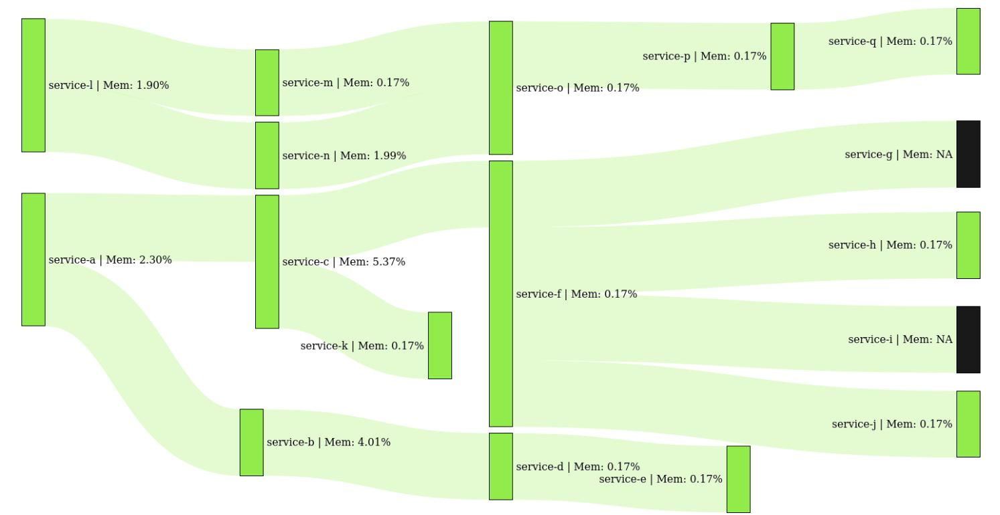
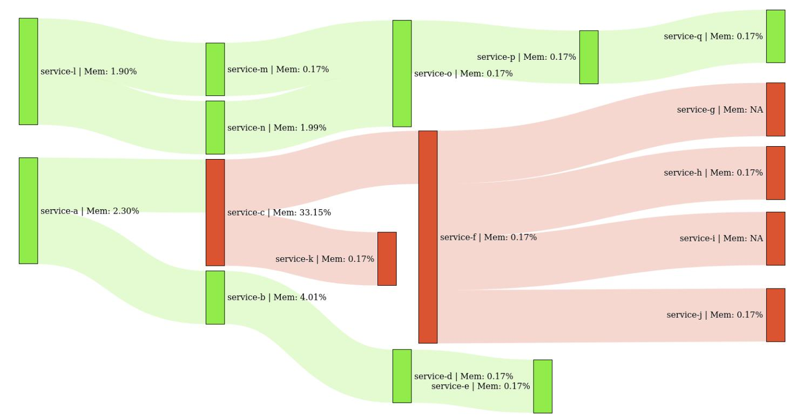

# Garuda

Garuda aims to observe the cascading effect of interdependent containers in a Kubernetes.  
This repo is the Backend containing Rest APIs of this system.

### System Architecture

### Cascading Effect Observation

#### Network Diagram with no failing service

#### Network Diagram with failing service and their cascading effect

##

Tech Stack

- FastAPI - Python
- Postgres
- D3.js
- Kubernetes
- Docker
- Prometheus
